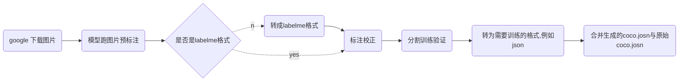

背景：
模型落地过程中，需要针对模型badcase收集特定场景的图片进行加强训练。下面记录了这个迭代的过程与工具的使用方法，主要包括收集数据、模型预标注、校正标注、转为训练格式。



# google 下载图片
**安装：**
+ 根据教程~/ScriptCollection/labels/Image-Downloader/README.md 下载对应版本的chrome driver；
+ 下载成功后，放在~/ScriptCollection/labels/bin/目录下；
**批量下载：**
例如，下载一批关键词为"人体工学椅"的图片，并存进名为data_ergonomic_chair的文件夹。
```sh
python ~/ScriptCollection/labels/Image-Downloader/image_downloader.py \
"人体工学椅" \
--max-number 10000 \
--output data_ergonomic_chair \
--driver chrome_headless \
--timeout 500
```
设置了最大1w张图片，通常情况下仅能下载到1k张左右的图片。

# coco2labelme
```sh
root = ...
name="data_ergonomic_chair"
python ~/ScriptCollection/labels/coco2labelme.py \
--j ${root}/${name}.json \
--i ${root}/${name} \
--s ${root}/${name}_labelme;
```

# split train and val
```sh
root = ...
python ~/ScriptCollection/labels/split_trainval.py \
--img_ann_dir ${root}/data_ergonomic_chair \
--img_type ergonomic_chair \
--train_path ${root}/train \
--val_path ${root}/val \
--rate 0.667
```

# labelme2coco
```sh
# classes_file | classes_file_pets
train_mode="val"
det_mode="pets"
obj_mode=""
root="/dataset/object_detection/coco_wider_pedestrian/google_images"
python ~/ScriptCollection/labels/labelme2coco.py \
--labelme_path ${root}/${train_mode} \
--classes_file ${root}/classes_file_pets.json \
--save_file ${root}/add_json/${train_mode}_${det_mode}_${obj_mode}.json \
--start_list dog_ cat_ ergonomic_

'''classes_file.json
{"1":"pedestrain"}
'''
```

# combine_coco
```sh
root="/dataset/object_detection/coco_wider_pedestrian/google_images/add_json"
python ~/ScriptCollection/labels/combine_coco.py \
--coco1 ${root}/add_val_person_ergonomic_chair.json \
--coco2 ${root}/add_val_person_2022-11-10.json \
--res_coco ${root}/add_val_person_2022-11-22.json
```

# balance coco
```sh
# train:2500 | val:800
python ~/ScriptCollection/labels/balance_coco.py \
--gt_path /dataset/object_detection/coco_wider_pedestrian/google_images/add_json/add_val_pets_2022-11-22.json \
--each_num 800
```

# combine_coco
```sh
python ~/ScriptCollection/labels/combine_coco.py \
--coco1 /dataset/object_detection/coco_wider_pedestrian/annotations/val.json \
--coco2 /dataset/object_detection/coco_wider_pedestrian/google_images/add_json/add_val_person_2022-11-22_balance.json \
--res_coco /dataset/object_detection/coco_wider_pedestrian/annotations/val_person_2022-11-22_balance.json
```

# get_coco_nums
```sh
python ~/ScriptCollection/labels/get_coco_nums.py \
--path /dataset/object_detection/coco_wider_pedestrian/google_images/add_json
```